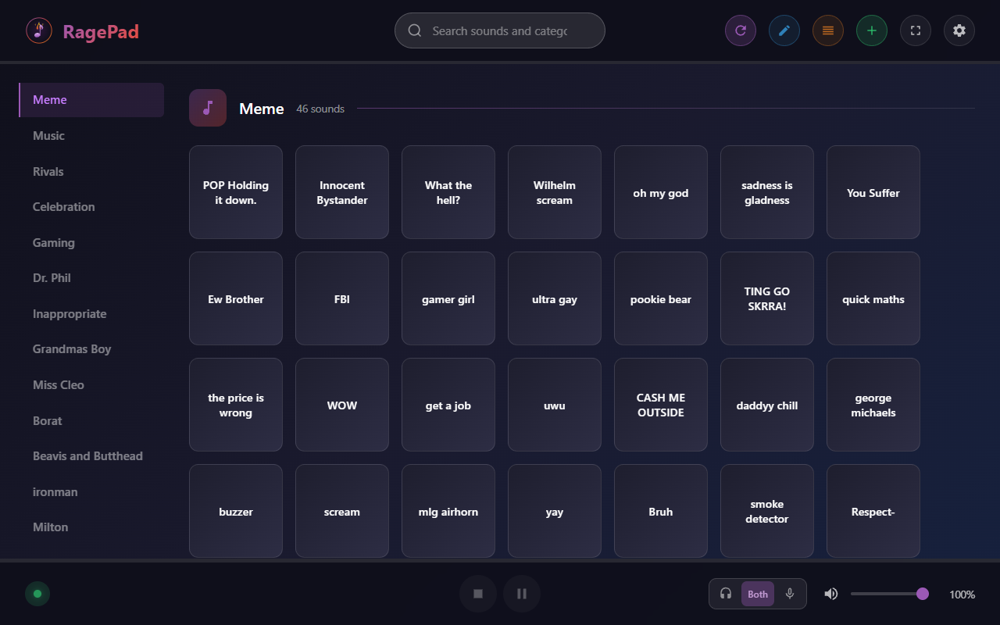
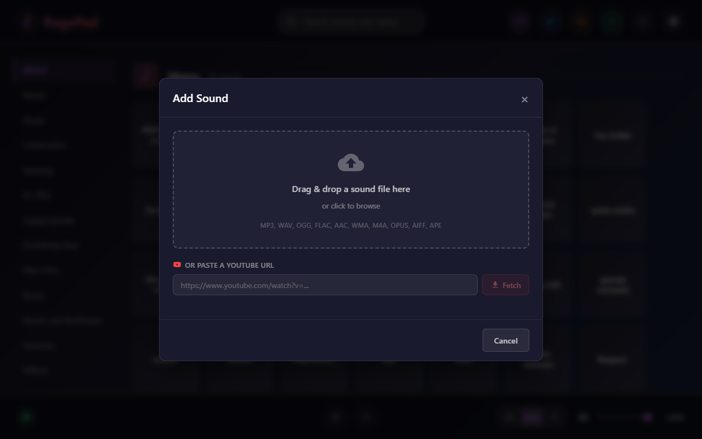

# Rage Pad

A Node.js application with an Angular frontend that provides a soundboard to list and play sounds. Ships as a standalone Windows desktop app via Tauri, or runs in any browser on your local network.

## Screenshots

### Soundboard
Browse your entire sound library organized by category with a clean dark-themed UI.



### Add Sound
Drag & drop audio files or paste a YouTube URL to add new sounds.




## Features

- Browse all sounds organized by category
- Search sounds by title, artist, or category
- Play sounds with a single click
- Pause/Resume and Stop playback controls
- Volume control with mic/speaker routing options
- Add sounds via file upload or YouTube URL with waveform preview & cropping
- Edit sound metadata (tag, title, artist, category) via right-click menu
- Drag-and-drop reordering of sounds and categories
- Real-time connection status with auto-launch
- QR code for quick phone access on your local network
- Responsive design for desktop and mobile
- Clean, modern dark-themed UI

## Installation (Windows)

1. Download the latest `.exe` installer from the [Releases](https://github.com/AceOfRage/rage-pad/releases) page.
2. Run the installer and follow the on-screen prompts.
3. Launch **Rage Pad** from the Start Menu or desktop shortcut.

That's it — the bundled app includes everything it needs to run.

## Development Setup

If you want to build from source or contribute to the project, follow the steps below.

### Development Prerequisites

- **Node.js** (v18 or higher)
- **Rust** toolchain (for Tauri)
- **Tauri CLI** (`npm install -g @tauri-apps/cli`)

### Project Structure

```
rage-pad/
├── src/
│   └── server/           # Express backend
│       ├── index.ts      # Server entry point
│       └── routes.ts     # API routes
├── client/               # Angular frontend
│   └── src/
│       └── app/
│           ├── components/     # UI components
│           ├── models/         # TypeScript interfaces
│           └── services/       # Angular services
├── src-tauri/             # Tauri desktop wrapper
├── package.json
├── tsconfig.server.json
└── README.md
```

### Install Dependencies

1. **Install root dependencies:**
   ```bash
   npm install
   ```

2. **Install Angular client dependencies:**
   ```bash
   cd client
   npm install
   cd ..
   ```

### Running in Development Mode

Run both the backend server and Angular dev server concurrently:

```bash
npm run dev
```

This will start:
- Backend server at `http://localhost:3000`
- Angular dev server at `http://localhost:4200`

### Building for Production

**Build the standalone Windows installer:**

```bash
npm run build:windows
```

This will compile the server, build the Angular client, bundle everything with a portable Node.js runtime, and produce an NSIS installer in `src-tauri/target/release/bundle/nsis/`.

**Or run production mode without Tauri:**

1. **Build the Angular client:**
   ```bash
   npm run build:client
   ```

2. **Build and start the server:**
   ```bash
   npm start
   ```

The application will be available at `http://localhost:3000`

## API Endpoints

| Method | Endpoint | Description |
|--------|----------|-------------|
| GET | `/api/status` | Check connection status |
| GET | `/api/sounds` | Get all sounds |
| GET | `/api/sounds/search?q=query` | Search sounds by title/artist |
| POST | `/api/sounds/:index/play` | Play a sound by index |
| POST | `/api/stop` | Stop current playback |
| POST | `/api/pause` | Toggle pause/resume |
| GET | `/api/playback` | Get current playback status |
| POST | `/api/volume` | Set volume (0-100) |

## Technologies Used

### Backend
- Node.js
- Express.js
- TypeScript
- Named Pipes (Windows IPC)

### Frontend
- Angular 17
- TypeScript
- SCSS
- RxJS

### Desktop
- Tauri 2

## Troubleshooting

### "Disconnected" status
- Restart the backend server

### No sounds appearing
- Ensure sounds are loaded in the library
- Click the "Refresh" button to reload sounds
- Check the browser console for errors

### Sounds not playing
- Check that the sound file exists and is valid

## License

MIT License
